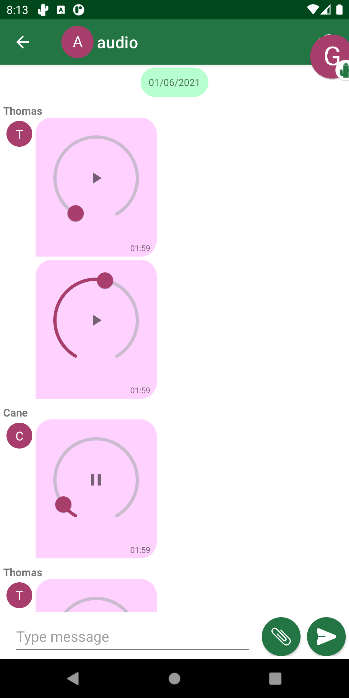
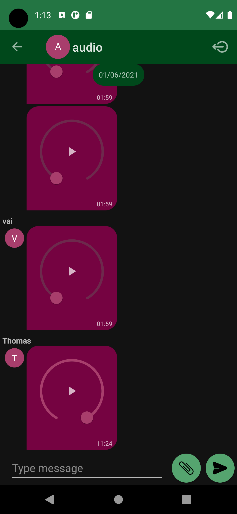
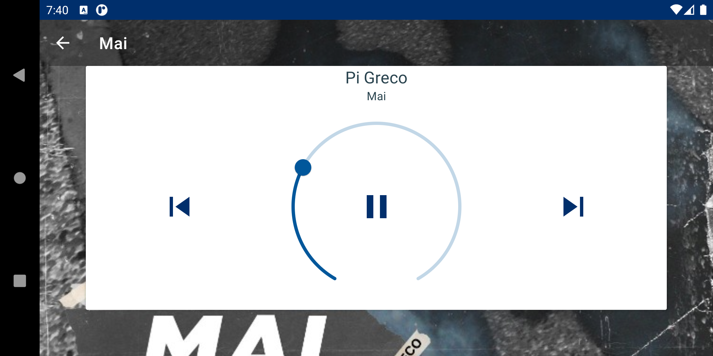

# MaterialSeekArc


[](https://jitpack.io/#simonebortolin/MaterialSeekArc)

Android 3rd party library to make implementing a MaterialSeekArc.
So what the heck is a SeekArc? Essentially it’s a SeekBar that has been wrapped around a circle. It acts like a SeekBar and generally has the same settings. You can even add a Listener to it as you would with a SeekBar. So if its in a circle why not call it a SeekCircle? The answer is that the SeekArc does have a few more setting than the SeekBar one of these is the sweepAngle, which means that the SeekArc doesn’t have to be drawn as a full circle, and can be drawn as a circle, semi-circle  or quarter arc or whatever you like. Supports min SDK 8. 


# Using the SeekArc

Using the SeekArc is straightforward. There are a number of settings from sweep angle to rotation that can be set. One of the less obvious settings is the radius or diameter of the SeekArc. When I developed the SeekArc I thought about adding an attribute for defining the diameter of the circle. In the end I decided against this. I thought a more flexible approach would be to allow the SeekArc to expand to the size of  its container layout. This way the SeekArc can grow in size with a layout that has widths or heights of match parent. Also it is still possible to set the SeekArc to a specific size by setting the container layouts width and height to specific dp values. This sizing approach gives the best of both worlds. To further adjust how the arc fits in its container a padding attribute can also be used.

To help with understanding how to use the SeeekArc I’ve put together a sample app with a number of controls that can be used to adjust the attributes of the SeekArc. This is by far the best way to get a good understanding of how to use the SeekArc. From the sample app you’ll see that it is possible to set attributes such as:

* Sweep angle
* Rotation
* Clockwise (which way do you want the progress to increase clockwise/anticlockwise),
* Arc and progress width
* Rounded corners 
* Touch inside enable/disable.
* Enabled - enables/disables touch and the thumbnail 

## Installation

This library is not yet released in Maven Central, until then you can add as a library module or use JitPack.io. 

Add remote maven url

```groovy
    repositories {
        maven {
            url "https://jitpack.io"
        }
    }
```
    
Now add a library dependency (remember to check for latest release)

```groovy
    dependencies {
        compile 'com.github.simonebortolin:SeekArc:2.0.0'
    }
```

## Use

Simply add the View to your layout (There are several custom attributes) 

        <com.simonebortolin.seekarc.MaterialSeekArc
            android:id="@+id/seekArc"
            android:layout_width="match_parent"
            android:layout_height="wrap_content"
            android:layout_gravity="center"
            android:padding="30dp"
            seekarc:rotation="180"
            seekarc:startAngle="30"
            seekarc:sweepAngle="300"
            seekarc:touchInside="true" />
            
            
# Recent changes 

## Version 2.0

New version completely material and written in Kotlin. The various parameter names are more faithful to those of the android SeekBar material, much code has been rewritten and more has been converted.


## Previous Version (< 2.0)

The changelog is available in [this github repository](https://github.com/neild001/SeekArc)
All that is left of the old version is the core and some basic functionality, but the whole logic has completely changed.

# Some Examples Project

You can see the MaterialSeekArc working in the sample application:







# License

```

The MIT License (MIT)

Copyright (c) 2013 Triggertrap Ltd
Author Neil Davies 

Permission is hereby granted, free of charge, to any person obtaining a copy of
this software and associated documentation files (the "Software"), to deal in
the Software without restriction, including without limitation the rights to
use, copy, modify, merge, publish, distribute, sublicense, and/or sell copies of
the Software, and to permit persons to whom the Software is furnished to do so,
subject to the following conditions:

The above copyright notice and this permission notice shall be included in all
copies or substantial portions of the Software.

THE SOFTWARE IS PROVIDED "AS IS", WITHOUT WARRANTY OF ANY KIND, EXPRESS OR
IMPLIED, INCLUDING BUT NOT LIMITED TO THE WARRANTIES OF MERCHANTABILITY, FITNESS
FOR A PARTICULAR PURPOSE AND NONINFRINGEMENT. IN NO EVENT SHALL THE AUTHORS OR
COPYRIGHT HOLDERS BE LIABLE FOR ANY CLAIM, DAMAGES OR OTHER LIABILITY, WHETHER
IN AN ACTION OF CONTRACT, TORT OR OTHERWISE, ARISING FROM, OUT OF OR IN
CONNECTION WITH THE SOFTWARE OR THE USE OR OTHER DEALINGS IN THE SOFTWARE.

```
